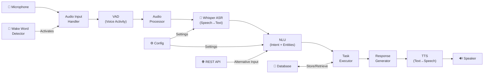

# 🎙️ Voice Assistant (ASR) — Complete Project Analysis

> Based on [Voice_Assistant_Complete_Documentation.pdf](file:///g:/Student/Project in Python/ASR/Voice_Assistant_Complete_Documentation.pdf) and full filesystem exploration.

---

## 📂 High-Level Project Structure

```
ASR/
├── src/voice_assistant/    ← Core application code (Python package)
├── config/                 ← YAML configuration files & env vars
├── tests/                  ← Unit, integration, e2e, performance tests
├── scripts/                ← Setup, deployment, maintenance, testing scripts
├── docker/                 ← Docker containerization files
├── kubernetes/             ← K8s deployment manifests & Helm charts
├── monitoring/             ← Grafana, Prometheus, logging, tracing
├── ci-cd/                  ← GitHub Actions, GitLab CI, Jenkins pipelines
├── docs/                   ← Sphinx documentation site
├── data/                   ← Runtime data (models, cache, DB, logs, backups)
├── notebooks/              ← Jupyter exploration & analysis notebooks
├── requirements/           ← Split dependency files (base/dev/test/prod/docs)
├── main.py                 ← Application entry point
├── setup.py / pyproject.toml / setup.cfg  ← Package metadata
└── ...config files (.editorconfig, tox.ini, Makefile, etc.)
```

---

## 1. `src/voice_assistant/` — Core Application Code

This is the main Python package. It follows a **modular pipeline architecture** where audio flows through: `Audio → ASR → NLU → Tasks → Response Generation → TTS`.

---

### 1.1 `core/` — Orchestration & Configuration

| File | Purpose | Code Type |
|------|---------|-----------|
| [orchestrator.py](file:///g:/Student/Project in Python/ASR/src/voice_assistant/core/orchestrator.py) | **Main `VoiceAssistant` class** — orchestrates the full pipeline (audio → ASR → NLU → task → response → TTS) | Python class with async pipeline, dependency injection, error handling |
| [config.py](file:///g:/Student/Project in Python/ASR/src/voice_assistant/core/config.py) | **Configuration management** — loads YAML configs, merges environment-specific overrides, validates settings | Python dataclass/Pydantic model, YAML parsing, env var substitution |
| [constants.py](file:///g:/Student/Project in Python/ASR/src/voice_assistant/core/constants.py) | **Global constants** — sample rates, model paths, intent labels, default thresholds | Python module with constant definitions (enums, frozen dataclasses) |
| [__init__.py](file:///g:/Student/Project in Python/ASR/src/voice_assistant/core/__init__.py) | Module exports | Package init |

> [!IMPORTANT]
> The orchestrator is the **central nervous system** of the project. All other modules are plugged into it.

---

### 1.2 `asr/` — Automatic Speech Recognition (Whisper)

| File | Purpose | Code Type |
|------|---------|-----------|
| [transcriber.py](file:///g:/Student/Project in Python/ASR/src/voice_assistant/asr/transcriber.py) | **`WhisperModel` & `Transcriber`** — loads OpenAI Whisper model (`large-v3-turbo`), performs speech-to-text transcription | PyTorch model loading, `faster-whisper` or `openai-whisper` API, GPU/CPU device management, `TranscriptionResult` dataclass |
| [processor.py](file:///g:/Student/Project in Python/ASR/src/voice_assistant/asr/processor.py) | **`ASRProcessor`** — preprocesses audio before transcription (resampling, normalization, chunking for long audio) | NumPy/SciPy audio processing, signal normalization, chunk-based streaming |
| [exceptions.py](file:///g:/Student/Project in Python/ASR/src/voice_assistant/asr/exceptions.py) | Custom ASR exceptions (model load failure, transcription errors, invalid audio format) | Python exception hierarchy |
| `models/` | Model configuration files or cached model weights | YAML/JSON config, binary model files |

---

### 1.3 `audio/` — Audio Capture, Processing & VAD

| File | Purpose | Code Type |
|------|---------|-----------|
| [input_handler.py](file:///g:/Student/Project in Python/ASR/src/voice_assistant/audio/input_handler.py) | **`AudioInputHandler`** — captures audio from microphone using PyAudio | PyAudio stream management, threading for real-time capture |
| [output_handler.py](file:///g:/Student/Project in Python/ASR/src/voice_assistant/audio/output_handler.py) | **`AudioOutputHandler`** — plays audio through speakers | PyAudio playback, audio format conversion |
| [audio_processor.py](file:///g:/Student/Project in Python/ASR/src/voice_assistant/audio/audio_processor.py) | **`AudioProcessor`** — audio preprocessing (resampling, noise reduction, normalization, format conversion) | NumPy/librosa/scipy audio processing, FFT, filtering |
| [vad.py](file:///g:/Student/Project in Python/ASR/src/voice_assistant/audio/vad.py) | **`VoiceActivityDetector`** — detects when someone is speaking vs. silence | Energy-based or ML-based VAD, thresholding, frame-level analysis |
| [buffer_manager.py](file:///g:/Student/Project in Python/ASR/src/voice_assistant/audio/buffer_manager.py) | **`AudioBufferManager`** — manages circular audio buffers for streaming | Thread-safe ring buffers, producer-consumer pattern |
| [exceptions.py](file:///g:/Student/Project in Python/ASR/src/voice_assistant/audio/exceptions.py) | Audio-related exceptions | Python exception classes |

---

### 1.4 `nlu/` — Natural Language Understanding

| File | Purpose | Code Type |
|------|---------|-----------|
| [intent_classifier.py](file:///g:/Student/Project in Python/ASR/src/voice_assistant/nlu/intent_classifier.py) | **`IntentClassifier`** — classifies user intent (e.g., `control_device`, `get_weather`, `play_music`) | ML classification (keyword-based or transformer), confidence scoring |
| [entity_extractor.py](file:///g:/Student/Project in Python/ASR/src/voice_assistant/nlu/entity_extractor.py) | **`EntityExtractor`** — extracts entities from text (device names, locations, times, etc.) | NER (Named Entity Recognition), regex patterns, slot filling |
| [preprocessor.py](file:///g:/Student/Project in Python/ASR/src/voice_assistant/nlu/preprocessor.py) | **Text preprocessor** — tokenization, lowercasing, stopword removal, text normalization | String processing, NLP preprocessing |
| [exceptions.py](file:///g:/Student/Project in Python/ASR/src/voice_assistant/nlu/exceptions.py) | NLU exceptions | Python exception classes |
| `models/` | Trained NLU model weights/configs | Serialized ML models (pickle/PyTorch) |

---

### 1.5 `tasks/` — Task Execution Engine

| File | Purpose | Code Type |
|------|---------|-----------|
| [executor.py](file:///g:/Student/Project in Python/ASR/src/voice_assistant/tasks/executor.py) | **`TaskExecutor`** — dispatches tasks based on detected intent to the right handler | Strategy/registry pattern, async execution |
| [registry.py](file:///g:/Student/Project in Python/ASR/src/voice_assistant/tasks/registry.py) | **Task registry** — maps intent names → handler classes | Dictionary/decorator-based registration pattern |
| [exceptions.py](file:///g:/Student/Project in Python/ASR/src/voice_assistant/tasks/exceptions.py) | Task execution exceptions | Python exception classes |
| **`handlers/`** | Individual task handlers: | |
| [audio_handler.py](file:///g:/Student/Project in Python/ASR/src/voice_assistant/tasks/handlers/audio_handler.py) | Handle music/audio playback commands | API calls to music services |
| [device_handler.py](file:///g:/Student/Project in Python/ASR/src/voice_assistant/tasks/handlers/device_handler.py) | Handle IoT device control (lights, thermostat) | HTTP/MQTT calls to smart home APIs |
| [knowledge_handler.py](file:///g:/Student/Project in Python/ASR/src/voice_assistant/tasks/handlers/knowledge_handler.py) | Handle knowledge/information queries | Web search API, knowledge base lookups |
| [system_handler.py](file:///g:/Student/Project in Python/ASR/src/voice_assistant/tasks/handlers/system_handler.py) | Handle system commands (volume, settings) | OS-level system calls |
| [time_handler.py](file:///g:/Student/Project in Python/ASR/src/voice_assistant/tasks/handlers/time_handler.py) | Handle time/alarm/reminder tasks | Datetime manipulation, scheduling |

---

### 1.6 `response_generation/` — Response Generation

| File | Purpose | Code Type |
|------|---------|-----------|
| [llm_engine.py](file:///g:/Student/Project in Python/ASR/src/voice_assistant/response_generation/llm_engine.py) | **LLM-based response generation** — calls OpenAI/local LLM to generate natural language responses | API calls to LLM endpoints (OpenAI, Ollama, etc.) |
| [template_engine.py](file:///g:/Student/Project in Python/ASR/src/voice_assistant/response_generation/template_engine.py) | **Template-based responses** — fills in response templates with task results | Jinja2/string template rendering |
| [formatter.py](file:///g:/Student/Project in Python/ASR/src/voice_assistant/response_generation/formatter.py) | **Response formatting** — structures output for TTS or display | Text formatting, SSML generation |
| [exceptions.py](file:///g:/Student/Project in Python/ASR/src/voice_assistant/response_generation/exceptions.py) | Response generation exceptions | Python exception classes |
| `models/` | Response model configs | Config/weight files |

---

### 1.7 `tts/` — Text-to-Speech

| File | Purpose | Code Type |
|------|---------|-----------|
| [synthesizer.py](file:///g:/Student/Project in Python/ASR/src/voice_assistant/tts/synthesizer.py) | **`TextToSpeech`** — converts text response to spoken audio (using pyttsx3 or other engines) | TTS engine wrapper (pyttsx3, gTTS, or edge-tts), audio generation |
| [processor.py](file:///g:/Student/Project in Python/ASR/src/voice_assistant/tts/processor.py) | **TTS post-processing** — audio normalization, speed adjustment, format conversion | Audio signal processing |
| [exceptions.py](file:///g:/Student/Project in Python/ASR/src/voice_assistant/tts/exceptions.py) | TTS exceptions | Python exception classes |
| `models/` | TTS model configs/voices | Config files |

---

### 1.8 `wake_word/` — Wake Word Detection

| File | Purpose | Code Type |
|------|---------|-----------|
| [detector.py](file:///g:/Student/Project in Python/ASR/src/voice_assistant/wake_word/detector.py) | **`WakeWordDetector`** — listens for activation keyword (e.g., "hey assistant") using Porcupine | Picovoice Porcupine SDK, continuous audio stream monitoring |
| [utils.py](file:///g:/Student/Project in Python/ASR/src/voice_assistant/wake_word/utils.py) | Wake word utility functions | Helper functions |
| `models/` | Porcupine model files (.ppn keyword files) | Binary model files |

> [!WARNING]
> Porcupine requires a **Picovoice API Access Key**. See the API Keys section below.

---

### 1.9 `api/` — REST API (FastAPI)

| File | Purpose | Code Type |
|------|---------|-----------|
| [server.py](file:///g:/Student/Project in Python/ASR/src/voice_assistant/api/server.py) | **FastAPI app factory** — creates and configures the API server | FastAPI app initialization, CORS, lifespan |
| [middleware.py](file:///g:/Student/Project in Python/ASR/src/voice_assistant/api/middleware.py) | **Request middleware** — authentication, rate limiting, request logging | FastAPI middleware classes |
| [schemas.py](file:///g:/Student/Project in Python/ASR/src/voice_assistant/api/schemas.py) | **Pydantic schemas** — request/response validation models | Pydantic v2 models |
| [exceptions.py](file:///g:/Student/Project in Python/ASR/src/voice_assistant/api/exceptions.py) | API exception handlers | FastAPI exception handlers |
| **`routers/`** | API route groups: | |
| [assistant.py](file:///g:/Student/Project in Python/ASR/src/voice_assistant/api/routers/assistant.py) | `/process`, `/transcribe` — main assistant endpoints | FastAPI router, async handlers |
| [commands.py](file:///g:/Student/Project in Python/ASR/src/voice_assistant/api/routers/commands.py) | `/commands` — command execution endpoints | FastAPI router |
| [health.py](file:///g:/Student/Project in Python/ASR/src/voice_assistant/api/routers/health.py) | `/health` — health check and readiness probes | FastAPI router |
| [metrics.py](file:///g:/Student/Project in Python/ASR/src/voice_assistant/api/routers/metrics.py) | `/metrics` — Prometheus-compatible metrics endpoint | FastAPI router, prometheus_client |

---

### 1.10 `storage/` — Data Persistence

| File | Purpose | Code Type |
|------|---------|-----------|
| [database.py](file:///g:/Student/Project in Python/ASR/src/voice_assistant/storage/database.py) | **SQLAlchemy database** — session management, connection pooling | SQLAlchemy async engine, session factory |
| [encryption.py](file:///g:/Student/Project in Python/ASR/src/voice_assistant/storage/encryption.py) | **Data encryption** — encrypt/decrypt sensitive data at rest | `cryptography` library (Fernet encryption) |
| [exceptions.py](file:///g:/Student/Project in Python/ASR/src/voice_assistant/storage/exceptions.py) | Storage exceptions | Python exception classes |
| `models/` | SQLAlchemy ORM models (users, conversations, commands) | SQLAlchemy declarative models |
| `migrations/` | Alembic database migration scripts | Alembic migration files |

---

### 1.11 `utils/` — Shared Utilities

| File | Purpose | Code Type |
|------|---------|-----------|
| [logger.py](file:///g:/Student/Project in Python/ASR/src/voice_assistant/utils/logger.py) | **Structured logging** using Loguru | Loguru configuration, log rotation, formatting |
| [metrics.py](file:///g:/Student/Project in Python/ASR/src/voice_assistant/utils/metrics.py) | **Performance metrics** — timing, counters, histograms | prometheus_client metrics, custom timing decorators |
| [validators.py](file:///g:/Student/Project in Python/ASR/src/voice_assistant/utils/validators.py) | **Input validators** — audio format, config schema, text input validation | Validation functions, Pydantic validators |
| [decorators.py](file:///g:/Student/Project in Python/ASR/src/voice_assistant/utils/decorators.py) | **Utility decorators** — retry, timing, caching | Python decorators with `functools` |
| [helpers.py](file:///g:/Student/Project in Python/ASR/src/voice_assistant/utils/helpers.py) | **Miscellaneous helpers** — file I/O, path utils, string formatting | General Python utility functions |
| [device_apis.py](file:///g:/Student/Project in Python/ASR/src/voice_assistant/utils/device_apis.py) | **Smart device API wrappers** — HTTP clients for IoT platforms | HTTP requests to smart home APIs |
| [exceptions.py](file:///g:/Student/Project in Python/ASR/src/voice_assistant/utils/exceptions.py) | Utility exceptions | Python exception classes |

---

## 2. `config/` — Configuration Files

| File | Purpose | Code Type |
|------|---------|-----------|
| [base.yaml](file:///g:/Student/Project in Python/ASR/config/base.yaml) | **Base configuration** — default ASR, NLU, TTS, wake word settings | YAML (⚠️ currently contains C++ merge sort code — needs to be replaced with actual YAML config) |
| [development.yaml](file:///g:/Student/Project in Python/ASR/config/development.yaml) | Dev overrides (CPU mode, debug logging, smaller models) | YAML |
| [production.yaml](file:///g:/Student/Project in Python/ASR/config/production.yaml) | Prod settings (GPU mode, optimized models, strict logging) | YAML |
| [staging.yaml](file:///g:/Student/Project in Python/ASR/config/staging.yaml) | Staging environment config | YAML |
| [testing.yaml](file:///g:/Student/Project in Python/ASR/config/testing.yaml) | Test environment config (mocked services) | YAML |
| [.env.example](file:///g:/Student/Project in Python/ASR/config/.env.example) | **Environment variable template** — API keys, secrets, DB URLs | Dotenv format (⚠️ currently empty) |
| `logging/` | Logging configuration (formatters, handlers, rotation) | YAML/JSON |
| `models/` | Model-specific configurations (whisper params, NLU thresholds) | YAML/JSON |

> [!CAUTION]
> `base.yaml` currently contains C++ merge sort code instead of actual YAML configuration! This file needs to be rewritten with proper voice assistant config.

---

## 3. `tests/` — Test Suite

### 3.1 `unit/` — Unit Tests

| File | Tests |
|------|-------|
| [test_transcriber.py](file:///g:/Student/Project in Python/ASR/tests/unit/test_transcriber.py) | WhisperModel loading, transcription accuracy, edge cases |
| [test_intent_classifier.py](file:///g:/Student/Project in Python/ASR/tests/unit/test_intent_classifier.py) | Intent detection for all supported intents |
| [test_entity_extractor.py](file:///g:/Student/Project in Python/ASR/tests/unit/test_entity_extractor.py) | Entity extraction (devices, locations, times) |
| [test_synthesizer.py](file:///g:/Student/Project in Python/ASR/tests/unit/test_synthesizer.py) | TTS audio generation |
| [test_task_executor.py](file:///g:/Student/Project in Python/ASR/tests/unit/test_task_executor.py) | Task dispatch and execution |
| [test_response_generator.py](file:///g:/Student/Project in Python/ASR/tests/unit/test_response_generator.py) | Response generation (template + LLM) |
| [test_audio_handler.py](file:///g:/Student/Project in Python/ASR/tests/unit/test_audio_handler.py) | Audio capture and processing |
| [test_database.py](file:///g:/Student/Project in Python/ASR/tests/unit/test_database.py) | Database operations, migrations |
| [test_wake_word_detector.py](file:///g:/Student/Project in Python/ASR/tests/unit/test_wake_word_detector.py) | Wake word detection |

### 3.2 `integration/` — Integration Tests

| File | Tests |
|------|-------|
| [test_audio_to_text.py](file:///g:/Student/Project in Python/ASR/tests/integration/test_audio_to_text.py) | Audio → ASR pipeline |
| [test_nlu_pipeline.py](file:///g:/Student/Project in Python/ASR/tests/integration/test_nlu_pipeline.py) | Text → Intent + Entities pipeline |
| [test_task_execution.py](file:///g:/Student/Project in Python/ASR/tests/integration/test_task_execution.py) | Intent → Task execution pipeline |
| [test_text_to_speech.py](file:///g:/Student/Project in Python/ASR/tests/integration/test_text_to_speech.py) | Response → TTS pipeline |
| [test_full_pipeline.py](file:///g:/Student/Project in Python/ASR/tests/integration/test_full_pipeline.py) | End-to-end pipeline test |

### 3.3 `e2e/` — End-to-End Tests

| File | Tests |
|------|-------|
| [test_user_interaction.py](file:///g:/Student/Project in Python/ASR/tests/e2e/test_user_interaction.py) | Simulated user conversations |
| [test_complex_commands.py](file:///g:/Student/Project in Python/ASR/tests/e2e/test_complex_commands.py) | Multi-step / compound commands |
| [test_error_scenarios.py](file:///g:/Student/Project in Python/ASR/tests/e2e/test_error_scenarios.py) | Error recovery and edge cases |

### 3.4 Other test directories

| Directory | Purpose |
|-----------|---------|
| `performance/` | Load testing, latency benchmarks |
| `coverage/` | Coverage reports output |
| `fixtures/` | Test audio files, mock data, sample configs |

**Code type**: All tests are **Python + pytest**, using fixtures, mocking (`unittest.mock`), and parametrized test cases.

---

## 4. `scripts/` — Automation Scripts

### 4.1 `setup/`

| File | Purpose | Code Type |
|------|---------|-----------|
| [setup_environment.py](file:///g:/Student/Project in Python/ASR/scripts/setup/setup_environment.py) | Set up Python env, install deps, create directories | Python |
| [install_dependencies.sh](file:///g:/Student/Project in Python/ASR/scripts/setup/install_dependencies.sh) | Install system-level dependencies (portaudio, ffmpeg) | Bash/Shell |
| [download_models.py](file:///g:/Student/Project in Python/ASR/scripts/setup/download_models.py) | Download Whisper, NLU, Porcupine model files | Python (HTTP downloads, progress bars) |
| [initialize_db.py](file:///g:/Student/Project in Python/ASR/scripts/setup/initialize_db.py) | Initialize SQLite/PostgreSQL database schema | Python (SQLAlchemy, Alembic) |

### 4.2 `deployment/`

| File | Purpose | Code Type |
|------|---------|-----------|
| [build_docker.sh](file:///g:/Student/Project in Python/ASR/scripts/deployment/build_docker.sh) | Build Docker images | Shell |
| [deploy_kubernetes.sh](file:///g:/Student/Project in Python/ASR/scripts/deployment/deploy_kubernetes.sh) | Deploy to Kubernetes cluster | Shell (kubectl) |
| [health_check.py](file:///g:/Student/Project in Python/ASR/scripts/deployment/health_check.py) | Verify deployment health | Python (HTTP health checks) |

### 4.3 `maintenance/`

| File | Purpose | Code Type |
|------|---------|-----------|
| [backup_database.py](file:///g:/Student/Project in Python/ASR/scripts/maintenance/backup_database.py) | Database backup automation | Python |
| [cleanup.py](file:///g:/Student/Project in Python/ASR/scripts/maintenance/cleanup.py) | Clean old logs, temp files | Python |
| [clear_cache.py](file:///g:/Student/Project in Python/ASR/scripts/maintenance/clear_cache.py) | Clear model/response caches | Python |
| [migrate_data.py](file:///g:/Student/Project in Python/ASR/scripts/maintenance/migrate_data.py) | Data migration between versions | Python (Alembic) |

### 4.4 `testing/`

| File | Purpose | Code Type |
|------|---------|-----------|
| [run_tests.sh](file:///g:/Student/Project in Python/ASR/scripts/testing/run_tests.sh) | Run full test suite | Shell |
| [run_coverage.sh](file:///g:/Student/Project in Python/ASR/scripts/testing/run_coverage.sh) | Run tests with coverage | Shell |
| [run_linting.sh](file:///g:/Student/Project in Python/ASR/scripts/testing/run_linting.sh) | Run linters (flake8, mypy, black) | Shell |
| [benchmark.py](file:///g:/Student/Project in Python/ASR/scripts/testing/benchmark.py) | Performance benchmarks | Python |

### 4.5 `utils/`

| File | Purpose | Code Type |
|------|---------|-----------|
| [logs_analyzer.py](file:///g:/Student/Project in Python/ASR/scripts/utils/logs_analyzer.py) | Analyze application logs | Python |
| [model_converter.py](file:///g:/Student/Project in Python/ASR/scripts/utils/model_converter.py) | Convert models between formats (ONNX, TorchScript) | Python (PyTorch, ONNX) |
| [performance_profiler.py](file:///g:/Student/Project in Python/ASR/scripts/utils/performance_profiler.py) | Profile code performance | Python (cProfile, line_profiler) |

---

## 5. `docker/` — Containerization

| File | Purpose | Code Type |
|------|---------|-----------|
| [Dockerfile](file:///g:/Student/Project in Python/ASR/docker/Dockerfile) | Production container image | Dockerfile (multi-stage build) |
| [Dockerfile.dev](file:///g:/Student/Project in Python/ASR/docker/Dockerfile.dev) | Development container with hot-reload | Dockerfile |
| [Dockerfile.test](file:///g:/Student/Project in Python/ASR/docker/Dockerfile.test) | Test runner container | Dockerfile |
| [docker-compose.yml](file:///g:/Student/Project in Python/ASR/docker/docker-compose.yml) | Multi-service orchestration (app + DB + monitoring) | Docker Compose YAML |
| [docker-compose.prod.yml](file:///g:/Student/Project in Python/ASR/docker/docker-compose.prod.yml) | Production compose overrides | Docker Compose YAML |
| [entrypoint.sh](file:///g:/Student/Project in Python/ASR/docker/entrypoint.sh) | Container startup script | Shell |
| [.dockerignore](file:///g:/Student/Project in Python/ASR/docker/.dockerignore) | Files to exclude from Docker context | Glob patterns |

---

## 6. `kubernetes/` — Kubernetes Deployment

| File | Purpose | Code Type |
|------|---------|-----------|
| [namespace.yaml](file:///g:/Student/Project in Python/ASR/kubernetes/namespace.yaml) | K8s namespace definition | K8s YAML manifest |
| [deployment.yaml](file:///g:/Student/Project in Python/ASR/kubernetes/deployment.yaml) | Pod deployment spec (replicas, containers, resources) | K8s YAML manifest |
| [service.yaml](file:///g:/Student/Project in Python/ASR/kubernetes/service.yaml) | ClusterIP/LoadBalancer service | K8s YAML manifest |
| [ingress.yaml](file:///g:/Student/Project in Python/ASR/kubernetes/ingress.yaml) | Ingress rules (routing, TLS) | K8s YAML manifest |
| [configmap.yaml](file:///g:/Student/Project in Python/ASR/kubernetes/configmap.yaml) | Config data mounted as volumes | K8s YAML manifest |
| [secret.yaml](file:///g:/Student/Project in Python/ASR/kubernetes/secret.yaml) | Encrypted secrets (API keys, DB passwords) | K8s YAML manifest |
| [hpa.yaml](file:///g:/Student/Project in Python/ASR/kubernetes/hpa.yaml) | Horizontal Pod Autoscaler | K8s YAML manifest |
| [pdb.yaml](file:///g:/Student/Project in Python/ASR/kubernetes/pdb.yaml) | Pod Disruption Budget | K8s YAML manifest |
| [networkpolicy.yaml](file:///g:/Student/Project in Python/ASR/kubernetes/networkpolicy.yaml) | Network security policies | K8s YAML manifest |
| `helm/` | Helm chart (templated deployments) | Helm YAML templates |
| `monitoring/` | K8s-specific monitoring resources | K8s YAML manifests |

---

## 7. `monitoring/` — Observability Stack

| Directory | Purpose | Code Type |
|-----------|---------|-----------|
| `prometheus/` | Metrics collection — [prometheus.yml](file:///g:/Student/Project in Python/ASR/monitoring/prometheus/prometheus.yml) (scrape config) + [alerts.yml](file:///g:/Student/Project in Python/ASR/monitoring/prometheus/alerts.yml) (alerting rules) | Prometheus YAML config |
| `grafana/dashboards/` | Pre-built Grafana dashboards (latency, throughput, errors) | Grafana JSON dashboard definitions |
| `grafana/provisioning/` | Grafana auto-provisioning for data sources & dashboards | YAML provisioning files |
| `logging/` | Centralized logging config (ELK/Loki integration) | YAML/JSON config |
| `tracing/` | Distributed tracing (OpenTelemetry/Jaeger) | YAML config |

---

## 8. `ci-cd/` — CI/CD Pipelines

| Directory | Purpose | Code Type |
|-----------|---------|-----------|
| `github-actions/` | GitHub Actions workflows (test, lint, build, deploy) | YAML workflow files |
| `gitlab-ci/` | GitLab CI pipeline definitions | `.gitlab-ci.yml` |
| `jenkins/` | Jenkins pipeline scripts | Groovy Jenkinsfile |

---

## 9. `docs/` — Documentation

| File | Purpose | Code Type |
|------|---------|-----------|
| [index.md](file:///g:/Student/Project in Python/ASR/docs/index.md) | Documentation home page | Markdown |
| [QUICK_START.md](file:///g:/Student/Project in Python/ASR/docs/QUICK_START.md) | Quick start guide | Markdown |
| [COMPLETE_GUIDE.md](file:///g:/Student/Project in Python/ASR/docs/COMPLETE_GUIDE.md) | Comprehensive usage guide | Markdown |
| [COMPONENT_OVERVIEW.md](file:///g:/Student/Project in Python/ASR/docs/COMPONENT_OVERVIEW.md) | Component architecture overview | Markdown |
| [PRACTICAL_EXAMPLES.md](file:///g:/Student/Project in Python/ASR/docs/PRACTICAL_EXAMPLES.md) | Working code examples | Markdown |
| [conf.py](file:///g:/Student/Project in Python/ASR/docs/conf.py) | Sphinx documentation config | Python |
| `api/` | Auto-generated API reference docs | RST/Markdown |
| `architecture/` | Architecture diagrams & design docs | Markdown + Mermaid |
| `deployment/` | Deployment guides | Markdown |
| `development/` | Developer contribution guide | Markdown |
| `performance/` | Performance tuning docs | Markdown |
| `user_guide/` | End-user guide | Markdown |

---

## 10. `data/` — Runtime Data

| Directory | Purpose |
|-----------|---------|
| `models/` | Downloaded ML model weights (Whisper, NLU models, Porcupine .ppn files) |
| `cache/` | Cached responses, processed audio, temporary data |
| `database/` | SQLite database files (conversations, user data) |
| `logs/` | Application log files (rotated by Loguru) |
| `backups/` | Database backups |

---

## 11. `notebooks/` — Jupyter Notebooks

| File | Purpose | Code Type |
|------|---------|-----------|
| [data_exploration.ipynb](file:///g:/Student/Project in Python/ASR/notebooks/data_exploration.ipynb) | Explore audio data, visualize waveforms/spectrograms | Python + matplotlib/librosa |
| [model_evaluation.ipynb](file:///g:/Student/Project in Python/ASR/notebooks/model_evaluation.ipynb) | Evaluate model accuracy (WER, intent accuracy) | Python + sklearn metrics |
| [performance_analysis.ipynb](file:///g:/Student/Project in Python/ASR/notebooks/performance_analysis.ipynb) | Analyze latency, throughput, resource usage | Python + pandas/matplotlib |

---

## 12. Root-Level Files

| File | Purpose | Code Type |
|------|---------|-----------|
| [main.py](file:///g:/Student/Project in Python/ASR/main.py) | **Application entry point** | Python |
| [setup.py](file:///g:/Student/Project in Python/ASR/setup.py) | Package installation (setuptools) | Python |
| [pyproject.toml](file:///g:/Student/Project in Python/ASR/pyproject.toml) | Modern Python project metadata | TOML (⚠️ currently empty) |
| [setup.cfg](file:///g:/Student/Project in Python/ASR/setup.cfg) | setuptools declarative config | INI |
| [requirement.txt](file:///g:/Student/Project in Python/ASR/requirement.txt) | Flat dependency list | pip requirements |
| [Makefile](file:///g:/Student/Project in Python/ASR/Makefile) | Build automation (`make test`, `make lint`, `make run`) | Makefile |
| [tox.ini](file:///g:/Student/Project in Python/ASR/tox.ini) | Multi-environment testing config | INI |
| [install.cmd](file:///g:/Student/Project in Python/ASR/install.cmd) | Windows installation script | Windows batch |
| [generate_pdf.py](file:///g:/Student/Project in Python/ASR/generate_pdf.py) | Generate the project documentation PDF | Python (ReportLab/FPDF) |

---

## 🔧 External Requirements

### Python Libraries (from [requirement.txt](file:///g:/Student/Project in Python/ASR/requirement.txt))

| Library | Version | Purpose |
|---------|---------|---------|
| **`torch`** | ≥2.0.0 | PyTorch deep learning framework — powers Whisper ASR model |
| **`torchaudio`** | ≥2.0.0 | Audio processing with PyTorch — waveform loading, transforms |
| **`numpy`** | ≥1.21.0 | Numerical computing — audio array operations |
| **`fastapi`** | ≥0.104.0 | REST API framework — `/process`, `/health` endpoints |
| **`uvicorn`** | ≥0.24.0 | ASGI server to run FastAPI |
| **`sqlalchemy`** | ≥2.0.0 | ORM for database operations |
| **`alembic`** | ≥1.12.0 | Database schema migrations |
| **`pydantic`** | ≥2.0.0 | Data validation (config, API schemas) |
| **`pydantic-settings`** | ≥2.0.0 | Settings management from env vars |
| **`python-dotenv`** | ≥1.0.0 | Load `.env` files |
| **`pyaudio`** | ≥0.2.13 | Microphone audio capture & playback |
| **`librosa`** | ≥0.10.0 | Audio analysis (spectrograms, MFCCs, resampling) |
| **`scipy`** | ≥1.11.0 | Signal processing, filtering |
| **`requests`** | ≥2.31.0 | HTTP client for external API calls |
| **`cryptography`** | ≥41.0.0 | Data encryption at rest |
| **`pyyaml`** | ≥6.0 | YAML config file parsing |
| **`loguru`** | ≥0.7.0 | Structured logging |
| **`pyporcupine`** | latest | Picovoice wake word detection engine |

### Additional Libraries (likely needed but not in requirements)

| Library | Purpose |
|---------|---------|
| `openai-whisper` or `faster-whisper` | Whisper ASR model (referenced in documentation) |
| `pyttsx3` | Offline TTS engine (referenced in config examples) |
| `openai` | OpenAI API client for LLM response generation |
| `prometheus_client` | Prometheus metrics export |
| `jinja2` | Template rendering for responses |
| `pytest` / `pytest-cov` / `pytest-asyncio` | Testing framework |
| `black` / `flake8` / `mypy` | Code quality tools |

---

### 🔑 API Keys & Secrets Required

| Key | Service | Where Used | How to Get |
|-----|---------|------------|------------|
| **Picovoice Access Key** | Porcupine Wake Word | `wake_word/detector.py` | Sign up at [picovoice.ai](https://picovoice.ai) (free tier available) |
| **OpenAI API Key** | GPT for response generation | `response_generation/llm_engine.py` | Sign up at [platform.openai.com](https://platform.openai.com) |
| **Database URL** | PostgreSQL/SQLite | `storage/database.py` | Local SQLite (no key needed) or PostgreSQL connection string |
| **Encryption Key** | Data encryption | `storage/encryption.py` | Auto-generated Fernet key via `cryptography` |
| Smart Home API Keys (optional) | IoT device control | `tasks/handlers/device_handler.py`, `utils/device_apis.py` | Platform-specific (SmartThings, Hue, etc.) |
| Weather API Key (optional) | Weather queries | `tasks/handlers/knowledge_handler.py` | OpenWeatherMap, WeatherAPI, etc. |

> [!NOTE]
> Store all API keys in a `.env` file (copy from `config/.env.example`). **Never commit secrets to git.**

---

### 🖥️ System Requirements

| Requirement | Minimum | Recommended |
|-------------|---------|-------------|
| **Python** | 3.10+ | 3.12 |
| **OS** | Windows 10 / Linux / macOS | Windows 11 / Ubuntu 22.04 |
| **RAM** | 8 GB | 16 GB+ |
| **GPU** | None (CPU mode works) | NVIDIA GPU with CUDA (for `large-v3-turbo` Whisper model) |
| **CUDA** | N/A | 11.8+ or 12.x |
| **Storage** | 5 GB (for models) | 10 GB+ |
| **Microphone** | Any USB/built-in mic | Quality mic for better ASR |
| **PortAudio** | Required for PyAudio | Install via system package manager |
| **FFmpeg** | Optional (audio format conversion) | Recommended |

---

## 🏗️ System Design — Data Flow Architecture



### Key Design Patterns Used

| Pattern | Where | Purpose |
|---------|-------|---------|
| **Pipeline / Chain** | Orchestrator | Sequential audio processing stages |
| **Strategy** | Task Executor + Handlers | Different handlers for different intents |
| **Registry** | Task Registry | Dynamic mapping of intents → handlers |
| **Factory** | API `create_app()` | Configurable app creation |
| **Repository** | Storage module | Data access abstraction |
| **Dependency Injection** | Orchestrator | Components injected via config |
| **Observer** | Wake Word Detector | Event-driven activation |
| **Middleware** | API | Cross-cutting concerns (auth, logging, rate limiting) |

---

## ⚠️ Issues Found During Analysis

> [!WARNING]
> The following issues were found in the current project state:

1. **`config/base.yaml`** contains C++ merge sort code instead of YAML configuration
2. **`pyproject.toml`** is empty — needs project metadata
3. **`config/.env.example`** is empty — needs template API keys
4. **`requirements/base.txt`** is empty — needs dependencies (only `requirement.txt` at root has them)
5. Several key libraries from the documentation (`openai-whisper`/`faster-whisper`, `pyttsx3`, `openai`) are missing from `requirement.txt`
